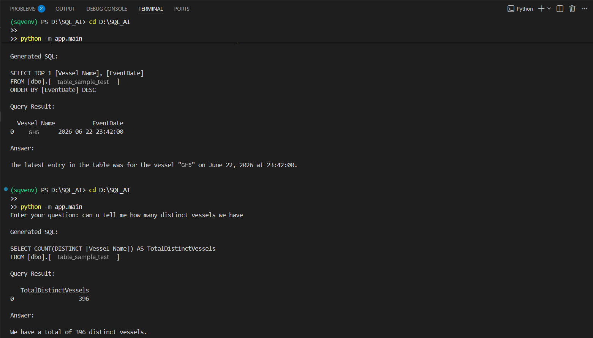

# AI SQL Analyst

Ask questions in plain English and get answers directly from your SQL database.

AI SQL Analyst converts natural language questions into SQL queries, executes them against a database, and returns the results in human-readable language. It is designed for users who need insights from data without writing SQL manually.

---

## Why AI SQL Analyst?

Many business users understand their data but are not comfortable writing SQL queries.

Instead of writing:

```sql
SELECT COUNT(DISTINCT customer_id)
FROM sales_data;
```

Users can simply ask:

> How many unique customers are in the database?

The application will:

1. Generate the SQL query
2. Execute it against the database
3. Retrieve the results
4. Explain the answer in plain English

---

## Example

### User Question

> Which product generated the highest revenue?

### Generated SQL

```sql
SELECT TOP 1
    product_name,
    SUM(revenue) AS total_revenue
FROM sales_data
GROUP BY product_name
ORDER BY total_revenue DESC;
```

### Natural Language Response

> Product A generated the highest total revenue based on the available records.

---

## Features

* Natural Language → SQL generation
* SQL query execution
* SQL validation layer
* Natural language result explanations
* SQL Server integration
* Schema-aware prompting
* Human-readable responses
* Configurable database connection
* Extensible architecture

---

## How It Works

```text
User Question
      ↓
Generate SQL Query
      ↓
Execute Query 
      ↓
Retrieve Results
      ↓
Generate Natural Language Answer
      ↓
Return Response
```

---

## Tech Stack

* Python
* SQL Server
* LangChain
* OpenAI
* Pandas
* PyODBC

---

## Example Questions

* How many customers placed orders this month?
* Which product generated the highest revenue?
* What were the total sales last quarter?
* Which employee handled the most orders?
* Show the top 5 customers by spending.
* What is the average order value?

---

AI-SQL-Analyst/
│
├── app/
│   ├── config.py
│   ├── database.py
│   ├── llm.py
|   ├── validator.py
│   ├── prompt_builder.py
│   └── main.py
│
├── .env.example
├── requirements.txt
└── README.md

---
## Installation

### 1. Clone the Repository

```bash
git clone https://github.com/yourusername/AI-SQL-Analyst.git
cd AI-SQL-Analyst
```

### 2. Create a Virtual Environment

```bash
python -m venv sqvenv
```

Activate the environment:

**Windows**

```bash
sqvenv\Scripts\activate
```

**Linux / macOS**

```bash
source sqvenv/bin/activate
```

### 3. Install Dependencies

```bash
pip install -r requirements.txt
```

---

## Configuration

Create a `.env` file in the project root.

Example:

```env
OPENAI_API_KEY=your_openai_api_key

DB_DRIVER=ODBC Driver 17 for SQL Server
DB_SERVER=localhost
DB_DATABASE=sample_database
DB_UID=username
DB_PWD=password

DEFAULT_TABLE=[dbo].[sample_table]
```

---

## Running the Application

From the project root:

```bash
python -m app.main
```

---

## Example Usage

Enter your question:

```text
Which product generated the highest revenue?
```

Generated SQL:

```sql
SELECT TOP 1
    product_name,
    SUM(revenue) AS total_revenue
FROM sales_data
GROUP BY product_name
ORDER BY total_revenue DESC;
```

Response:

```text
Product A generated the highest total revenue based on the available records.
```

---


## Future Improvements

* Multi-table support
* Query validation layer
* Conversational memory
* Data visualization
* FastAPI API endpoints
* Web UI
* Role-based access control

---

## Disclaimer

This project is intended for educational and development purposes. Generated SQL should be validated before execution in production environments.


